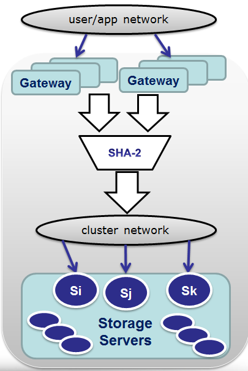
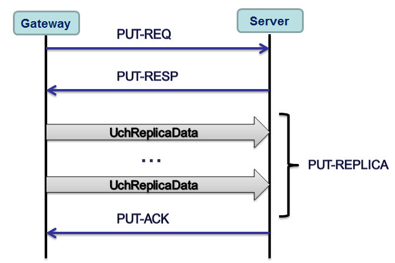

SURGE: discrete event Simulator for Unsolicited and Reservation Group based
       Edge-driven load balancing


## Overview

SURGE is a discrete event simulation framework written in Go. Targeted
modeling area includes (but is not limited to) large and super-large storage
clusters with multiple access points (referred to as "gateways") connected to
both user/application and storage networks.

Behind the gateways there are storage targets aka servers. Together gateways
and servers (that can in real life be collocated on the same physical or
virtual machines) are referred to as nodes and form a distributed cluster.



Both "gateway" and "server" are fundamental abstractions with a great variety
of realizations. Gateways are typically responsible for the first stages
of IO pipeline (including write logging and caching, compression and/or
deduplication, chunking/striping, checkumming, and ultimately, distributing
user content across two or more servers). While backend servers in turn
provide the ultimate stable storage. There are variations of course.
						  
Each storage node (gateway or server) in the SURGE is a separate
lightweight thread: a goroutine. The framework connects all configured nodes
bidirectionally via a pair of per node (Tx, Rx) Go channels. At each model's
startup all clustered nodes (of this model) get automatically connected and
ready to Go: send, receive and handle events and IO requests from all other
nodes.

## Gateway

The term "gateway" is widespread: there are internet gateways, cloud storage
gateways, security gateways - the latter defined in RFC 2663, for instance,
where they are called Application Level gateways or ALGs. While concrete
functions differ in a wide range, the common thing about gateways is that
they all implement and support two or more *types* of network interfaces.

SURGE's gateway is an abstraction that models storage access point, on one
hand. On another, each gateway has a full connectivity to all clustered
storage servers via internal storage network which in turn is modeled as
a bunch of point to point (bandwidth configurable, default 10Gbps) lossless
links.

## Models

Overall, the idea and the motivation to develop this framework and concrete
models based on it comes out of (naturally):

* unanswered questions, also sometimes called "ideas"
* chronic lack of hardware to setup massive distributed benchmarks
* total lack of time to build/validate the former and run/compare the latter

SURGE models are named. The repository contains a growing number of
built-in models named "1" (m1.go), "2" (m2.go), "3" (m3.go), etc. that are
being added both for illustration and regression testing purposes

The following couple models must be set apart as they both represent
certain non-trivial aspects of distributed storage processing:

* m5.go "Unicast Consistent Hash distribution using Captive Congestion Point"
* m6.go "Unicast Consistent Hash distribution using AIMD"

These two "unicast" models support the following generic pipeline:



- where for each data chunk there is a certain configurable number of replicas
that must be stored (the default is 3), and for each replica each of the
configured gateways randomly selects one of the configured servers and executes
the depicted handshake followed by transmission of MTU-size data packets.

Each replica is then separately acknowledged. All data and control transfers
are in fact simulated. The resulting performance provides further food for thought.

More details in the code.

The Usage section below provides examples to run and test any/all built-in
models, with command-line options that include numbers of gateways and servers
in the simulated cluster, time to run the benchmark, log verbosity, and more.

## Services

The SURGE framework currently provides the following initial services:

* Time 

Each time a model starts running, the (modeled) time starts from 0 (literal zero
- not to be confused with 00:00:00 1/1/1970) and then advances forward in
(configurable) steps. Each step of the internal global universal timer is
currently set to 10 nanoseconds, which also means that the margin of error to
execute a given timed event can be up to 9 nanoseconds (finer time-stepping
granularity may slow down your simulated benchmarks..)

The framework enforces the following simple rule: each event scheduled to
trigger at a given time does get executed at approximately this time with a very
high level of precision (see above). This statement may sound a bit circular but
the consequence of this is that modeled NOW does not advance until all the
events scheduled at NOW do in fact execute. Which is exactly how the time is (or
at least supposed to be) in a real world unless we lose track of it..

* Logging

By default the logger will log into a file named /tmp/log.csv. Both the filename and the
verbosity levels from quiet (default) to super-super-verbose 'vvv' - are
configurable.

* Statistics

There is initial generic support for per-model custom counters. Each new
counter is declared and registered at a model's init time via StatsDescriptor:

```go
type StatsDescriptor struct {
	name  string
	kind  StatsKindEnum
	scope StatsScopeEnum
}
```

Once registered, the framework will keep track of summing it up and/or
averaging, depending on the kind and scope of the counter. For this to happen,
the modeled gateways and servers provide GetStats() method as per examples
in the code.

* Multi-tasking and concurrency

Accomplished via Go routines and Go channels. Ultimately, each concrete model
must provide NewGateway()/NewServer() constructors for its own clustered nodes
and their specific Run() methods. It is also expected that at startup the
gateways start generating traffic (thus simulating the user/application IOs that
would arrive at the gateways of real clusters). The rest is done by the
SURGE framework, at least that's the intent.

* Reusable code

Much of the common routine is offloaded to a basic class (type) called
RunnerBase. The latter provides utility functions and implements part of the
abstract interfaces that all clustered gateways, servers, and in the future -
(remote) disks and network switches - must implement as well..

## Usage

To run all built-in models, one after another back to back:

```go
package main

import "surge"

func main() {
	surge.RunAllModels()
}
```

Use -h or --help to list command-line options; example below assumes the code
that contains main() (see e.g. above) is named example.go:

```
$ go run cmd/ck.go -h
$ go run cmd/ck.go --help
```

If you don't want to build/install surge package, run it using 'go test'
from the local project's directory:

```
$ cd surge
$ go test -m 3 -servers 20 -gateways 10 -v
```
The example runs a certain built-in model named '3' with 20
simulated servers, 10 gateways and log level verbosity '-v'.
Next example below does the same except that the model "3" will run for
150 simulated milliseconds:

When using 'go test' to run surge's models, do not forget the default
10 minutes timeout of the former. The following will run the model "5" for
up to 2 i(real) hours for the 100 simulated milliseconds:

```
$ go test -timeout 120m -m 5 -ttr 100ms
```

```
$ go run cmd/ck.go -m 3 -servers 20 -gateways 10 -ttr 150ms -v
```
